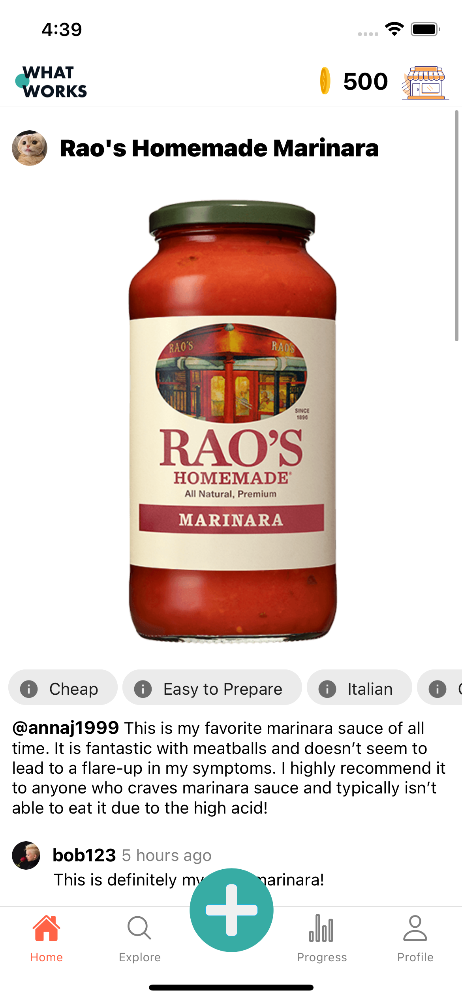
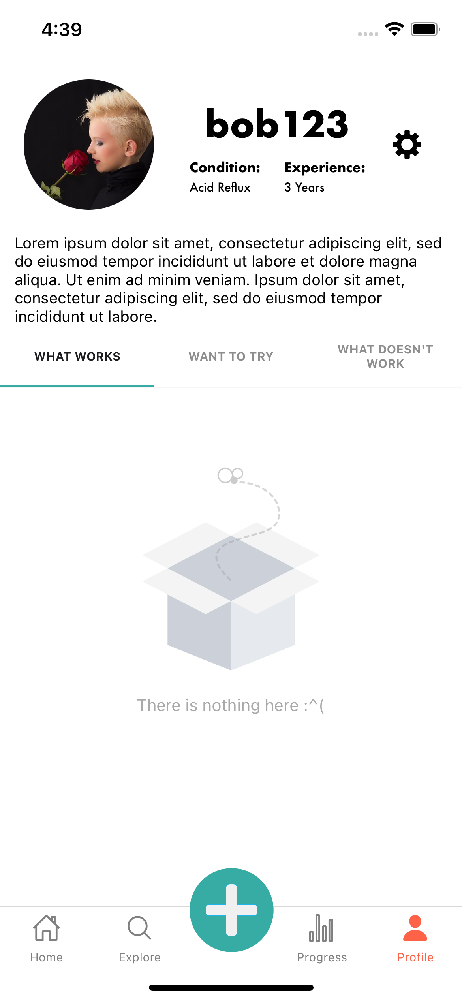

# WhatWorks

Welcome to our Application!

 
Our mobile app helps users with chronic acid reflux who want to manage their daily symptoms by finding the products that work for them and allowing users to track their reactions so that they can take control of their symptom management and improve their overall quality of life.
 
 
Feel free to take around in our repo!
 
 

